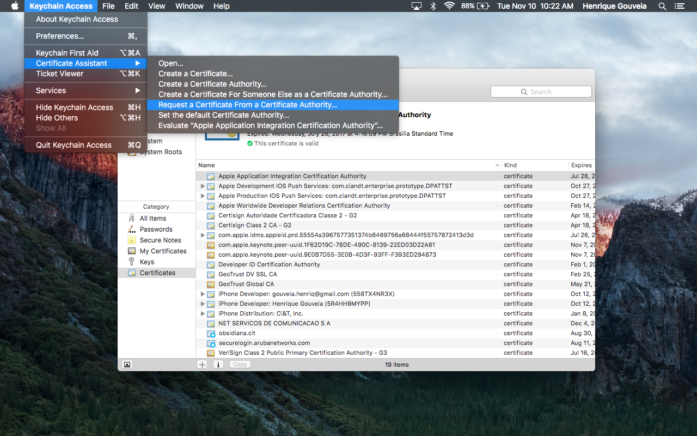
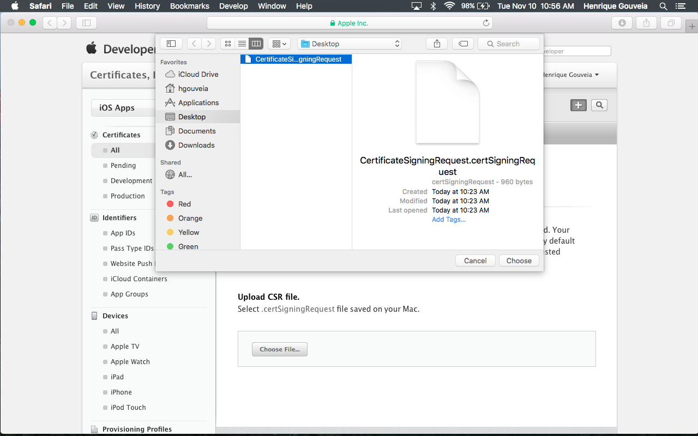
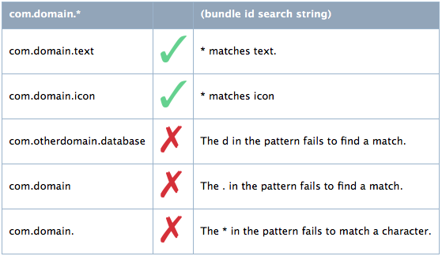

#Environment

###IDE

O Xcode IDE está no centro da experiência de desenvolvimento da Apple. Totalmente integrado com os quadros de Cocoa e Cocoa Touch, Xcode é um ambiente extremamente produtivo para a criação de aplicativos para Mac, iPhone e iPad.

Porque tudo é tão bem integrado, os fluxos de trabalho são naturais. Como você compor uma nova interface, o editor assistente apresenta intuitivamente os respectivos códigos fonte em um painel em janela dividida. Basta arrastar o mouse para conectar controles de interface do usuário para o código de implementação. Tecnologias de compilador Apple LLVM para analisar seu código, mantendo cada símbolo que você vê no LLDB debugger consistente com o editor e compilador. Conforme você digita a engine está em trabalho constante, encontrando erros e oferecendo Fix-its para o seu código.

O desenvolvedor pode se comunicar com o site da Apple diretamente pelo xCode, assim você pode ativar serviços como Game Center ou Passbook em seu aplicativo com um único clique. Em conjunto com o OS X Server, Xcode pode configurar um bot remoto para o ambiente de continuous integration, analisar, testar, e até mesmo empacotar seu aplicativo. Quando seu aplicativo está pronto, o Xcode irá agrupar e apresentar o seu aplicativo para a que você submita seu aplicativo para a App Store.

[**Download Xcode**](https://developer.apple.com/xcode/download/)

###Gerenciador de Dependências

Utilizamos o [Cocoapods](https://cocoapods.org), construído em ruby, como gerenciador de dependências. No OS X o Ruby vem instalado por padrão, não precisa se preocupar em instalá-lo.

Para instalar o Cocoapods basta executar o seguinte comando no terminal.

Após o cocoapods ser instalado, vá na pasta do seu projeto e crie um arquivo nomeado Podfile com a seguinte estrutura

Para incluir as libs que você deseja basta inserir " pod 'LibDesejada', 'versão' " abaixo do target. Para facilitar esse trabalho execute o comando pod init e ele criará a estrutura padrão. É altamente recomendado que use esse comando.

Após criado o Podfile e adicionadas as libraries desejadas execute o seguinte comando

Certifique-se de sempre abrir o workspace gerado pelo cocoapods para o projeto.

###Apple Developer Certificate

Para desenvolvimento na plataforma iOS é necessário que se tenha certificado válido e provisioning profile para a aplicação, portanto é necessário gerar um certificado por desenvolvedor.

Para isso há uma série de passos a serem feitos.

1º - É necessário solicitar uma assinatura de certificado.

2º - Preencha os campos com suas credenciais developer apple.

3º - Depois de gerado o *CertificateSigningRequest.certSigningRequest* vá ao [*Member Center*](https://developer.apple.com) e feito o login procure a área *Certificates, Identifiers & Profiles*

4º - Clique no botão *Add *para criar um novo certificado.

5º - Selecione a opção *iOS Development*.

6º - Faça o upload do arquivo gerado no passo 2 e em seguida clique em *Generate*.

7º - Pronto! Agora o seu certificado e chave aparecerão no keychain.

###Creating an App ID

###Clientes de Versionamento

Quando todo o repositório do seu projeto estiver versionado no SVN recomendamos que utilize o [Cornerstone](https://www.zennaware.com/cornerstone/index.php), pago, porém a Ci&T possui licenças.

Se o repositório for baseado no git pode utilizar [SourceTree](https://www.sourcetreeapp.com) ou [Github Desktop](https://desktop.github.com).
