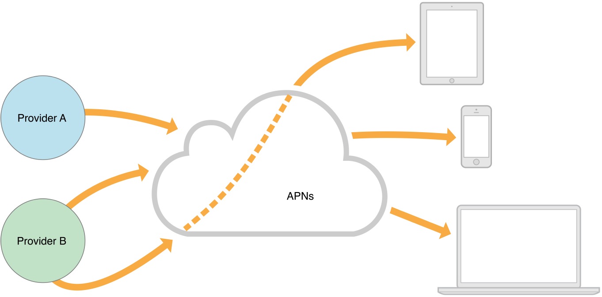

#Remote Push Notification

O mecanismo de push é muito utilizado para propagar informação a partir de um servidor, alguns exemplos de uso seriam: um novo comentário na rede social, uma nova mensagem no chat, algum relatório o qual o processamento foi concluído no servidor. E todos esses casos quando você deseja realmente garantir a entrega ao usuário, mesmo que o app não esteja em execução ou nem sequer em background. Dois pontos de atenção são: a conexão a internet é fundamental para receber essa notificação e é necessário habilitar o mecanismo de push notification no certificado de sua app.

1. **A Remote Notification and Its Path**

	* Apple Push Notification service é responsável por transportar e entregar uma remote notification de um determinado provider a um determinado device. A notificação é uma curta mensagem constituída por duas partes de dado: o device token e o payload. O device token é análogo ao número de telefone; ele contém informações que permitem a APNs para localizar cada device para um client app instalado. O payload é uma JSON-defined que especifica como o usuário de uma app no device irá ser alertado.

		

		
		Figure 1  Pushing a remote notification from a provider to a client app

	

		
		Figure 2  Pushing remote notifications from multiple providers to multiple devices

0. **Service-to-Device Connection Trust**

	* Estabelece a identidade de um dispositivo de conexão através TLS peer-to-peer authentication

	

0. **Provider-to-Service Connection Trust**

	* A conexão segura entre o provider e APNs é também estabelecida através deTLS peer-to-peer authentication.

	

0. **Token Generation and Dispersal**

	A app precisa se registrar para receber remote notifications. Isso geralmente acontece logo após abrir o app pela primeira vez, pois no método *didFinishLaunchingWithOptions *colocamos o seguinte código para tal propósito.

	

	Esse trecho de código permite o funcionamento ilustrado abaixo:

	

	O token gerado chegará no seguinte método, que também deve ser implementado.

	

	O hexToken é o código identificador do seu device para sua app, esse é o código que deverá ser enviado ao web service provider, como mostra o esquema abaixo:

	

	É necessário também implementar o seguinte método pelo qual os dados do push será recebido.

	

Para saber mais detalhes e características dos mecanismos de push veja a docuementação oficial [AQUI](https://developer.apple.com/library/ios/documentation/NetworkingInternet/Conceptual/RemoteNotificationsPG/Chapters/ApplePushService.html#//apple_ref/doc/uid/TP40008194-CH100-SW9).
