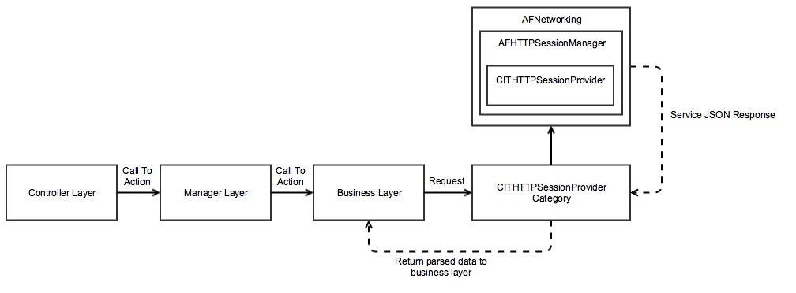
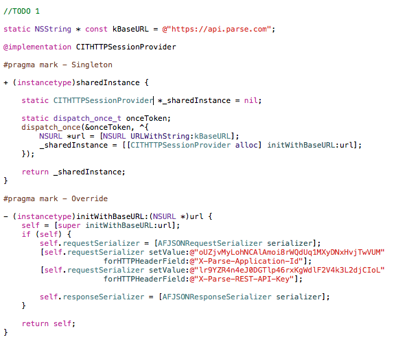
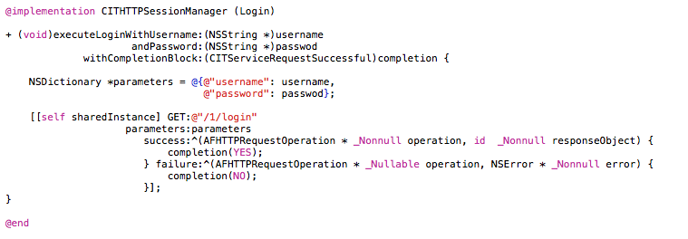

**Service**

Com o propósito de comunicação com o web service utilizamos o AFNetworking como library de alta abastração do [Foundation URL Loading System](http://developer.apple.com/library/mac/#documentation/Cocoa/Conceptual/URLLoadingSystem/URLLoadingSystem.html). O AFNetworking possui uma arquitetura modular e bem desenhada conseguiu simplificar os callbacks e serializações do Foundation URL.

O Foundation URL funciona dessa forma:

O AFNetworking está acima de tudo isso, ou seja, toda a parte de cache management, cookie storage, protocolo, autenticação e etc ele cuida para nós e nos proporciona objetos e flags simples para a configuração dos mesmos.

Abaixo podemos conferir como encaixar essa library em nossa arquitetura.

Para melhor entendimento você pode conferir um código exemplo [AQUI](https://github.com/CIT-SWAT/iOS-ReferenceArchitecture/tree/master/NetworkSample).

* **CITHTTPSessionProvider (//TODO 1)**

    * Herda a principal classe do AFNetworking. *AFHTTPSessionManager.*

    * Para melhor controle das requisições e configuração do Header aplicamos o *singleton pattern *para garantir a integridade.

    * Faça o override do método *initWithBaseURL *e configure o *request* e *response* *serializer*.

* **CITHTTPSessionProvicer Category (//TODO 2)**

    * Deve se criar uma category exclusiva para cada serviço.

    * Os métodos de consumo ao serviço devem ser estáticos.

    * Para callback do service response devemos usar blocks.

    * Caso sejam poucos parâmetros a serem enviados no body podemos construir o dicionário no método da categoria, porém se for muito complexo essa serialização deverá ficar no modelo.

