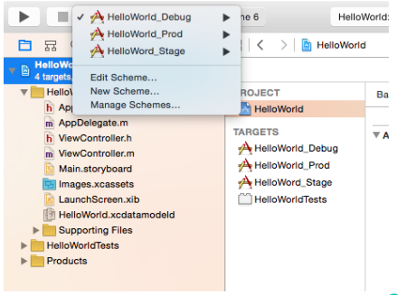
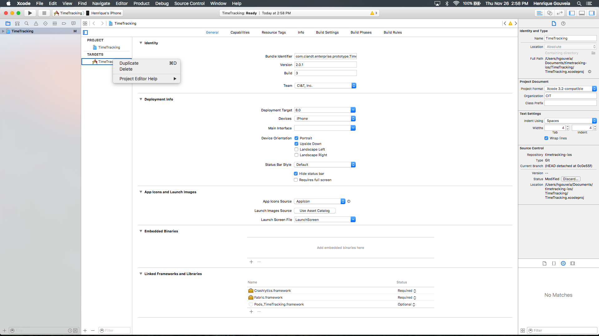
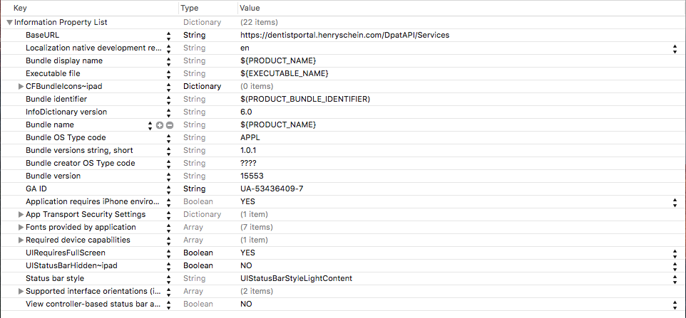

#Targets

Targets permitem que você tenha configurações específicas para cada ambiente que você tenha.

Um target especifíca um produto e contém instruções para construí-lo a partir de um conjunto de arquivos em um projeto ou workspace. Um target é referente a um único produto, porém os source files podem ser compartilhados entre os múltiplos targets que um projeto possa ter.

Recomendamos targets para facilitar na separação e fácil configuração do ambiente de CI para gerar build para cada ambiente visto que as sessãos de build settings, capabilities, build phases e o plist são exclusivas para cada target.

###Criando Targets

O ideal é duplicar o target já existente e então apenas renomear o novo target para algo que faça sentido, geralmente colocamos o NomeDoProjeto_ambiente.

#Xcode Scheme

Um scheme do xCode pode definir a configuração de build, coleção de testes a serem executados, dependência entre targets.

Você pode ter quantos schemes você quiser, mas somente um estará ativo por vez, até mesmo porque esse será o scheme que será utilizar para executar o app, seja o destino o hardware ou o simulador.

É recomendado que se tenha um schema por target de ambiente criado.

#Plist

Cada schema possui o seu plist, ou seja, é um ótimo lugar para adicionar configurações exclusivas de cada target.

